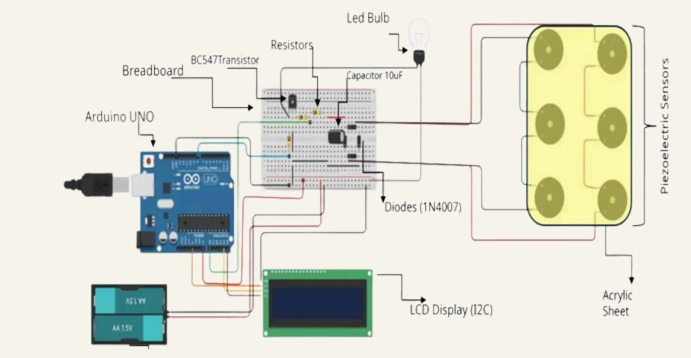

# ⚡ Smart Footstep Power Generation System

A sustainable micro-energy harvesting system that converts mechanical pressure from footsteps into electrical power using piezoelectric sensors, processed and displayed using Arduino UNO and an I2C LCD screen.

## 📌 Features
- **Energy Harvesting:** Converts impact energy into usable DC current via a full-wave bridge rectifier.
- **Real-Time Step Counter:** Accurately counts physical footsteps with debounce filtering.
- **Voltage Output Display:** Shows continuous voltage readings on a 16x2 I2C LCD screen.
- **Efficient Code:** Utilizes dynamic timing to prevent missed step inputs.

## 🛠️ Hardware Components
- Arduino UNO
- Piezoelectric Sensor Array (Parallel/Series layout)
- 1N4007 Diodes (Bridge Rectifier Circuit)
- 10uF Capacitor & BC547 Transistor
- 16x2 LCD Module with I2C Backpack (Address: 0x27)
- 3.7V Li-ion Battery Setup
- Acrylic Base Sheet

## 🔌 Circuit & Hardware Setup

## 💻 How to Run
1. Open `Footstep_Power.ino` in the Arduino IDE.
2. Ensure `LiquidCrystal_I2C` library is installed.
3. Select board **Arduino Uno** and the correct COM port.
4. Upload the code and press on the piezo array to generate power and track steps.
## 📄 Documentation
- [View Full Project Report](./Project%20Reports...pdf)
